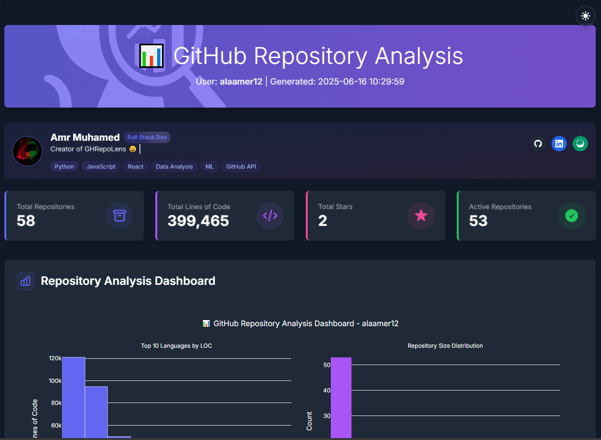

# GHRepoLens

<div align="center">
  
  
  [](https://opensource.org/licenses/MIT)
  [](https://www.python.org/downloads/)
  [](https://docs.python.org/3/library/asyncio.html)
  [](docs/QUICK_START.md)
</div>

GHRepoLens is a powerful GitHub repository analysis tool that provides comprehensive insights into your GitHub repositories through interactive visualizations and detailed analytics. With its modern UI and rich feature set, it helps developers and organizations understand their codebase better.

<div align="center">
  
</div>

## 🔍 Key Features

### 📊 Repository Analysis
* **Code Statistics**
  - Lines of code analysis with language breakdown
  - File type distribution and categorization
  - Repository size and complexity metrics
  - Historical growth trends

* **Activity Metrics**
  - Commit frequency patterns
  - Active vs inactive repository identification
  - Contribution trend analysis
  - Team collaboration insights

* **Quality Assessment**
  - Documentation coverage analysis
  - Test presence detection
  - CI/CD integration verification
  - Code organization evaluation

* **Advanced Analytics**
  - Repository health scoring
  - Anomaly detection in codebases
  - Best practices compliance checking
  - Cross-repository comparisons

### 📈 Interactive Dashboard
* **Modern Interface**
  - Responsive Tailwind CSS design
  - Light/Dark theme support
  - Custom theme configuration
  - Animated HTML backgrounds

* **Dynamic Visualizations**
  - Interactive Plotly charts
  - Repository metrics breakdown
  - Language distribution analysis
  - Activity heatmaps

* **Chart Embedding**
  - Iframe embedding for charts
  - Vercel deployment integration
  - Share visualizations with teammates
  - Embed in documentation & dashboards

### 🚀 Technical Features
* **Performance Optimizations**
  - Asynchronous processing
  - Parallel repository analysis
  - Efficient data caching
  - Rate limit handling

* **Analysis Modes**
  - Demo Mode (10 repos max)
  - Full Analysis Mode
  - Test Mode (single repo)
  - Custom scope analysis

* **Enhanced UI/UX**
  - Rich terminal interface
  - Progress tracking
  - Interactive configuration
  - Detailed error reporting

* **Data Management**
  - Multiple export formats
  - Checkpoint system
  - Data persistence
  - Resume capability

## 📋 Requirements

* Python 3.8 or higher
* GitHub Personal Access Token (with repo scope)
* Internet connection
* 500MB minimum free disk space
* Memory: 4GB recommended

## 🚀 Quick Start

1. **Installation**
   ```bash
   # Clone repository
   git clone https://github.com/alaamer12/GHRepoLens.git
   cd GHRepoLens

   # Create virtual environment
   python -m venv .venv
   source .venv/bin/activate  # On Windows: .venv\Scripts\activate

   # Install dependencies
   pip install -r requirements.txt
   ```

2. **Configuration**
   Create a `.env` file:
   ```ini
   GITHUB_TOKEN=your_personal_access_token
   GITHUB_USERNAME=your_github_username
   ```

3. **Run Analysis**
   ```bash
   python main.py
   ```

## 🔧 Configuration Options

### Environment Variables
```bash
export GITHUB_TOKEN="your_token"
export GITHUB_USERNAME="your_username"
```

### Configuration File (config.ini)
```ini
[github]
token = your_token
username = your_username

[analysis]
reports_dir = reports
clone_dir = temp_repos
max_workers = 4
inactive_threshold_days = 180
large_repo_loc_threshold = 1000

[filters]
skip_forks = false
skip_archived = false
visibility = all  # all, public, or private
analyze_clones = false
include_orgs = org1,org2

[checkpointing]
enable_checkpointing = true
checkpoint_file = analyzer_checkpoint.pkl
checkpoint_threshold = 100
resume_from_checkpoint = true

[iframe]
iframe_embedding = disabled  # disabled, partial, or full
vercel_token = your_vercel_token
vercel_project_name = ghrepolens-yourname

[theme]
# See THEME_CONFIG.md for all theme options
```

## 📊 Generated Reports

The tool generates comprehensive reports in multiple formats:

### Analysis Reports
* `repo_details.md` - Per-repository analysis
* `aggregated_stats.md` - Cross-repository statistics
* `visual_report.html` - Interactive dashboard
* `repository_data.json` - Raw analysis data

### Visualizations
* Language distribution charts
* Activity heatmaps
* Quality metric graphs
* Trend analysis plots

## 🛠️ Advanced Usage

### Analysis Modes
```bash
python main.py --mode demo    # Analyze up to 10 repos
python main.py --mode full    # Analyze all repos
python main.py --mode test    # Quick test with 1 repo
```

### Custom Configuration
```bash
python main.py --config custom_config.ini
python main.py --resume  # Resume from checkpoint
```

### Iframe Embedding
```bash
python main.py --iframe partial  # Deploy key chart files
python main.py --iframe full     # Deploy all HTML files
```

## 📚 Documentation

* [Detailed Usage Guide](docs/USAGE.md) - Comprehensive usage instructions
* [Theme Configuration](docs/THEME_CONFIG.md) - Customize appearance
* [Iframe Embedding](docs/IFRAME_EMBEDDING.md) - Share charts via iframe
* [Recent Changes](docs/CHANGES.md) - Latest updates

## 🤝 Contributing

1. Fork the repository
2. Create feature branch (`git checkout -b feature/amazing-feature`)
3. Commit changes (`git commit -m 'Add amazing feature'`)
4. Push to branch (`git push origin feature/amazing-feature`)
5. Open a Pull Request

See [CONTRIBUTING.md](CONTRIBUTING.md) for detailed guidelines.

## 📜 License

This project is licensed under the MIT License - see the [LICENSE](LICENSE) file for details.

## 🙏 Acknowledgments

* [PyGithub](https://github.com/PyGithub/PyGithub) - GitHub API integration
* [Plotly](https://plotly.com/python/) - Interactive visualizations
* [Rich](https://github.com/Textualize/rich) - Terminal formatting
* [python-dotenv](https://github.com/theskumar/python-dotenv) - Environment management
* [Vercel](https://vercel.com/) - Chart hosting for iframe embedding

---

<div align="center">
  <p>Made with ❤️ for the open-source community</p>
  <p>© 2025 GHRepoLens Contributors</p>
</div>
