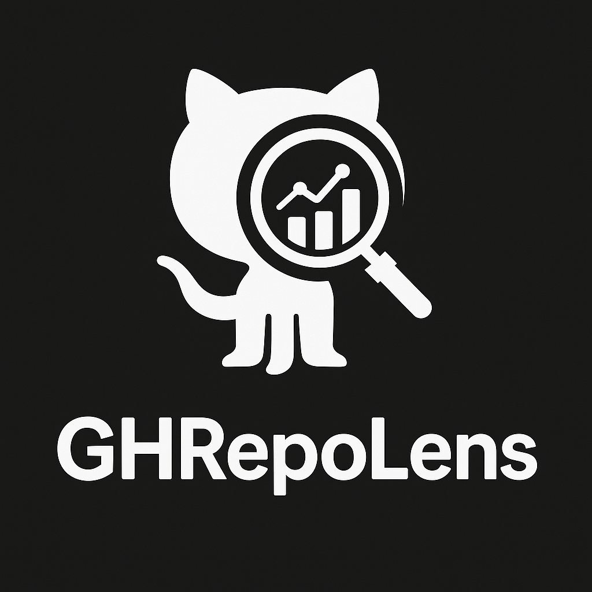

# GHRepoLens

<div align="center">
  
  
  [](https://opensource.org/licenses/MIT)
  [](https://www.python.org/downloads/)
  [](https://docs.python.org/3/library/asyncio.html)
</div>

GHRepoLens is a powerful analysis tool that gives you unprecedented visibility into your GitHub repositories. It crawls through your public and private repositories (with proper authentication), analyzing code, commits, contributors, and more to generate comprehensive reports and interactive visualizations.

## 🔍 Key Features

### 📊 In-depth Repository Analysis
* **Code Statistics**: Total lines of code, language distribution, file type breakdown
* **Activity Tracking**: Commit frequency, active/inactive repos, contribution patterns
* **Quality Metrics**: Documentation coverage, test presence, CI/CD integration
* **Anomaly Detection**: Flag repos with unusual patterns (high LOC with no tests, etc.)
* **Multi-repo Support**: Analyze all your repos at once with a single token

### 📈 Interactive Visualizations
* **Responsive Dashboard**: Modern UI with theme support built with Tailwind CSS
* **Interactive Charts**: Drill down into repository data with Plotly charts
* **Comparative Views**: Cross-repository comparisons on multiple metrics
* **Custom Filtering**: Focus on specific languages, time periods, or metrics
* **Light/Dark Mode**: Theme switching with persistent user preferences

### 📝 Comprehensive Reporting
* **Markdown Reports**: Detailed per-repository reports with TOC navigation
* **Aggregated Insights**: Summary statistics across your entire GitHub account
* **JSON Export**: Raw data for programmatic consumption or custom analysis
* **Visual Reports**: Static charts for sharing and presentations
* **Actionable Recommendations**: Suggestions for improving repository quality

### ⚙️ Advanced Capabilities
* **Async Processing**: Fast asynchronous processing of repository data
* **Rate Limit Management**: Intelligent handling of GitHub API limits with checkpointing
* **Environment Variables**: Support for .env files via python-dotenv
* **Themeable Output**: Customize visualization appearance
* **Progress Tracking**: Real-time progress indicators with Rich progress bars
* **Local File Analysis**: Detailed scanning of cloned repositories
* **Resume Support**: Continue interrupted analysis runs from checkpoint
* **Multiple Analysis Modes**: Demo, Full, and Test modes for different use cases

## 📋 Prerequisites

* Python 3.8 or higher
* GitHub Personal Access Token with repo scope
* Internet connection for API access

## 🚀 Installation

### From Source
```bash
# Clone the repository
git clone https://github.com/alaamer12/GHRepoLens.git
cd GHRepoLens

# Set up a virtual environment (recommended)
python -m venv .venv
source .venv/bin/activate  # On Windows: .venv\Scripts\activate

# Install dependencies
pip install -r requirements.txt
```

### Using pip (coming soon)
```bash
pip install ghrepolens
```

## 🔧 Configuration

You can configure GHRepoLens in several ways:

1. **Environment Variables**:
   ```bash
   export GITHUB_TOKEN="your_personal_access_token"
   export GITHUB_USERNAME="your_github_username"
   ```

2. **.env File**:
   Create a `.env` file in the root directory:
   ```
   GITHUB_TOKEN=your_personal_access_token
   GITHUB_USERNAME=your_github_username
   ```

3. **INI Configuration File**:
   Create a `config.ini` file in the root directory:
   ```ini
   [github]
   token = your_personal_access_token
   username = your_github_username
   
   [analysis]
   reports_dir = reports
   clone_dir = temp_repos
   max_workers = 4
   
   [filters]
   skip_forks = false
   skip_archived = false
   include_private = true
   ```

4. **Interactive Input**:
   If no token or username is provided, the tool will prompt you interactively.

## 📖 Usage

### Basic Usage
```bash
# Run with configuration from .env file or environment variables
python main.py

# The tool will prompt you to select an analysis mode:
# 1. Demo mode - Analyze up to 10 repositories
# 2. Full analysis - Analyze all repositories
# 3. Test mode - Quick test with 1 repository
```

### Analysis Modes

GHRepoLens offers three analysis modes to suit different needs:

1. **Demo Mode**: Analyzes up to 10 repositories, perfect for getting a quick overview or testing the tool.

2. **Full Analysis**: Analyzes all repositories for the specified user, providing comprehensive results.

3. **Test Mode**: Analyzes only 1 repository for rapid testing and validation.

### Command Line Parameters (coming soon)
```bash
# Specify token and username directly
python main.py --token YOUR_TOKEN --username YOUR_USERNAME

# Run in specific mode
python main.py --mode demo|full|test

# Use a custom config file
python main.py --config custom_config.ini

# Resume from checkpoint
python main.py --resume
```

## 📂 Project Structure

```
GHRepoLens/
├── analyzer.py       # Core analysis logic
├── config.py         # Configuration handling
├── lens.py           # Main orchestration class
├── main.py           # CLI entry point with async support
├── models.py         # Data models
├── reporter.py       # Report generation
├── utilities.py      # Helper functions
├── visualizer.py     # Visualization generation
├── reports/          # Generated reports output
└── assets/           # Static assets
```

## 📊 Output Examples

After running GHRepoLens, you'll find several reports in the `reports/` directory:

- `repo_details.md` - Detailed per-repository analysis
- `aggregated_stats.md` - Summary statistics across all repositories
- `visual_report.html` - Interactive dashboard with visualizations
- `repository_data.json` - Raw data in JSON format
- Various `.png` files - Static visualizations for different metrics

## 🤝 Contributing

Contributions are welcome! Please feel free to submit a Pull Request.

1. Fork the repository
2. Create your feature branch (`git checkout -b feature/amazing-feature`)
3. Commit your changes (`git commit -m 'Add some amazing feature'`)
4. Push to the branch (`git push origin feature/amazing-feature`)
5. Open a Pull Request

See [CONTRIBUTING.md](CONTRIBUTING.md) for more information.

## 📜 License

This project is licensed under the MIT License - see the [LICENSE](LICENSE) file for details.

## 🙏 Acknowledgments

- Thanks to the PyGithub library for GitHub API integration
- Plotly and Matplotlib for visualization capabilities
- Rich library for beautiful terminal interfaces
- Python-dotenv for environment variable management
- All contributors who have helped improve this project

---

<div align="center">
  <p>Made with ❤️ for open-source developers and GitHub power users.</p>
  <p>© 2025 GHRepoLens Contributors</p>
</div>
